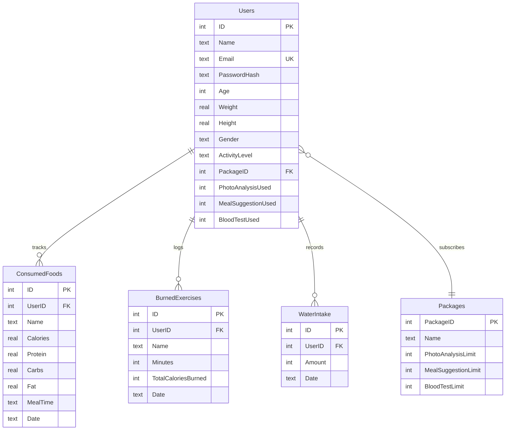

<div align="center">

# 🥗 DiyetGPT — AI-Powered Diet & Calorie Tracker

### Yapay Zeka Destekli Diyet ve Kalori Takip Uygulaması

[](https://reactjs.org/)
[](https://www.typescriptlang.org/)
[](https://nodejs.org/)
[](https://ai.google.dev/)
[](https://www.sqlite.org/)
[](https://vitejs.dev/)
[](LICENSE)

<br/>

**DiyetGPT**, Google Gemini 2.5 Flash yapay zeka modelini kullanan, kullanıcıların günlük kalori alımını takip etmesini, yemek fotoğrafı analizi yapmasını, kan testi sonuçlarını değerlendirmesini ve kişiselleştirilmiş diyet önerileri almasını sağlayan full-stack bir web uygulamasıdır.

<br/>

[🚀 Kurulum](#-kurulum) · [✨ Özellikler](#-özellikler) · [📡 API Dökümantasyonu](#-api-endpoint-dökümantasyonu) · [🏗️ Mimari](#️-proje-mimarisi)

</div>

---

## ✨ Özellikler

### 🤖 Yapay Zeka Modülleri
| Özellik | Açıklama |
|---------|----------|
| 📸 **Fotoğraf ile Besin Analizi** | Yemek fotoğrafı yükleyin, Gemini Vision kalori, protein, karbonhidrat ve yağ değerlerini otomatik hesaplasın |
| 💬 **AI Diyet Koçu (Chat)** | DiyetGPT ile sohbet ederek beslenme, spor ve sağlıklı yaşam tavsiyeleri alın |
| 🧪 **Kan Testi Analizi** | Laboratuvar sonuçlarınızı metin veya fotoğraf olarak yükleyin, referans dışı değerleri ve beslenme önerilerini görün |
| 🍳 **Akıllı Tarif Üretici** | Elinizde bulunan malzemeleri girin, AI size sağlıklı tarifler önersin (sıkı/esnek mod) |

### 📊 Günlük Takip
- 🍽️ **Kalori & Makro Takibi** — Yemek ekle, sil, günlük kalori/protein/karbonhidrat/yağ takibi yap
- 🏋️ **Egzersiz Kaydı** — Yapılan egzersizleri ve yakılan kalorileri kaydet
- 💧 **Su Tüketimi** — Günlük su alımını takip et
- 📅 **Tarih Bazlı Loglar** — Geçmiş günlere ait tüm verilere ulaş

### 👤 Kullanıcı Yönetimi
- 🔐 Kayıt & Giriş (bcrypt şifreli)
- 📝 Profil yönetimi (boy, kilo, yaş, cinsiyet, aktivite seviyesi)
- 📦 Paket sistemi (Free / Normal / Premium) — kullanım limitleri ve aylık sıfırlama

---

## 🛠️ Teknoloji Yığını

### Frontend
| Teknoloji | Kullanım Amacı |
|-----------|---------------|
| **React 18** + **TypeScript** | UI bileşenleri ve tip güvenliği |
| **Vite 7** | Hızlı geliştirme sunucusu ve build |
| **React Router v6** | Sayfa yönlendirme (SPA) |
| **Framer Motion** | Animasyonlar ve geçiş efektleri |
| **Axios** | HTTP istekleri |
| **Radix UI** | Erişilebilir dialog bileşenleri |
| **Sonner** | Toast bildirimleri |
| **TailwindCSS 3** | Utility-first CSS |

### Backend
| Teknoloji | Kullanım Amacı |
|-----------|---------------|
| **Node.js** + **Express** | REST API sunucusu |
| **SQLite3** | Yerel veritabanı (sıfır konfigürasyon) |
| **Google Generative AI SDK** | Gemini 2.5 Flash entegrasyonu |
| **Multer** | Dosya yükleme (fotoğraf analizi) |
| **bcrypt** | Şifre hash'leme |
| **express-session** | Oturum yönetimi |
| **JWT** | Token tabanlı kimlik doğrulama |

---

## 🚀 Kurulum

### Ön Gereksinimler
- [Node.js](https://nodejs.org/) (v18+)
- [npm](https://www.npmjs.com/) veya [pnpm](https://pnpm.io/)
- [Google Gemini API Key](https://aistudio.google.com/apikey)

### 1. Repoyu Klonlayın

```bash
git clone https://github.com/ziyaguner/DiyetGPT.git
cd DiyetGPT
```

### 2. Backend Kurulumu

```bash
cd backend
npm install
```

`.env` dosyası oluşturun:

```env
GEMINI_API_KEY=your_gemini_api_key_here
SESSION_SECRET=your_secret_key_here
PORT=5000
```

### 3. Frontend Kurulumu

```bash
cd frontend
npm install
```

### 4. Uygulamayı Başlatın

**Backend** (Terminal 1):
```bash
cd backend
npm run dev
```

**Frontend** (Terminal 2):
```bash
cd frontend
npm run dev
```

> 🌐 Frontend: `http://localhost:5173` — Backend: `http://localhost:5000`

---

## 📡 API Endpoint Dökümantasyonu

### 🔑 Kimlik Doğrulama

| Method | Endpoint | Açıklama |
|--------|----------|----------|
| `POST` | `/register` | Yeni kullanıcı kaydı |
| `POST` | `/login` | Giriş yap |
| `POST` | `/logout` | Çıkış yap |

### 👤 Kullanıcı

| Method | Endpoint | Açıklama |
|--------|----------|----------|
| `GET` | `/api/user` | Oturum bilgilerini getir |
| `PUT` | `/api/user/profile` | Profil güncelle |
| `POST` | `/api/subscribe` | Paket değiştir |

### 🍽️ Besin Takibi

| Method | Endpoint | Açıklama |
|--------|----------|----------|
| `POST` | `/api/add-food` | Yemek ekle |
| `DELETE` | `/api/delete-food/:id` | Yemek sil |
| `POST` | `/api/add-exercise` | Egzersiz ekle |
| `DELETE` | `/api/delete-exercise/:id` | Egzersiz sil |
| `POST` | `/api/add-water` | Su kaydı ekle |
| `GET` | `/api/daily-logs?date=YYYY-MM-DD` | Günlük logları getir |

### 🤖 Yapay Zeka

| Method | Endpoint | Açıklama |
|--------|----------|----------|
| `POST` | `/api/analyze-image` | Yemek fotoğrafı analizi (multipart) |
| `POST` | `/api/analyze-blood-test` | Kan testi analizi |
| `POST` | `/api/chat` | AI diyet koçu ile sohbet |
| `POST` | `/api/generate-recipe` | AI tarif üretici |

---

## 🏗️ Proje Mimarisi

```
DiyetGPT/
├── frontend/                   # React + TypeScript (Vite)
│   ├── src/
│   │   ├── pages/
│   │   │   ├── main.tsx        # Uygulama giriş noktası & routing
│   │   │   ├── Dashboard.tsx   # Ana panel (kalori takip, grafikler)
│   │   │   ├── Login.tsx       # Giriş sayfası
│   │   │   ├── Register.tsx    # Kayıt sayfası
│   │   │   └── PhotoAnalysis.tsx  # Fotoğraf analiz sayfası
│   │   └── index.css
│   ├── components/             # Yeniden kullanılabilir UI bileşenleri
│   ├── lib/                    # Yardımcı fonksiyonlar
│   └── vite.config.ts
│
├── backend/                    # Node.js + Express API
│   ├── server.js               # Tüm API endpointleri & iş mantığı
│   ├── database.sqlite         # SQLite veritabanı (otomatik oluşturulur)
│   ├── uploads/                # Geçici fotoğraf yüklemeleri
│   └── .env                    # Ortam değişkenleri (API anahtarları)
│
└── .gitignore
```

### Veritabanı Şeması



---

## 📦 Paket Sistemi

| Paket | Fotoğraf Analizi | Tarif Önerisi | Kan Testi | Fiyat |
|-------|:----------------:|:-------------:|:---------:|:-----:|
| 🆓 **Free** | 5 / ay | 5 / ay | 1 / ay | Ücretsiz |
| ⭐ **Normal** | 20 / ay | 20 / ay | 5 / ay | — |
| 💎 **Premium** | ♾️ Sınırsız | ♾️ Sınırsız | ♾️ Sınırsız | — |

> Kullanım limitleri her ay otomatik olarak sıfırlanır.

---

## 🔒 Güvenlik

- Şifreler **bcrypt** ile hash'lenerek saklanır
- Oturum yönetimi **express-session** ile sağlanır
- API anahtarları `.env` dosyasında tutulur (`.gitignore`'da)
- Veritabanı dosyaları ve kullanıcı yüklemeleri Git'e dahil edilmez
- CORS politikası yalnızca izin verilen origin'lere açıktır

---

## 🤝 Katkıda Bulunma

1. Bu repoyu **fork** edin
2. Yeni bir **branch** oluşturun (`git checkout -b feature/yeni-ozellik`)
3. Değişikliklerinizi **commit** edin (`git commit -m 'feat: yeni özellik eklendi'`)
4. Branch'inizi **push** edin (`git push origin feature/yeni-ozellik`)
5. Bir **Pull Request** açın

---

## 📄 Lisans

Bu proje [MIT Lisansı](LICENSE) ile lisanslanmıştır.

---

<div align="center">

**⭐ Bu projeyi beğendiyseniz yıldız vermeyi unutmayın!**

Made with ❤️ and 🤖 AI

</div>
