<div align="center">


<br/>

<a href="https://github.com/ziyaguner/DiyetGPT">
  
</a>

<br/><br/>

[](https://reactjs.org/)
[](https://www.typescriptlang.org/)
[](https://nodejs.org/)
[](https://ai.google.dev/)
[](https://www.sqlite.org/)
[](https://vitejs.dev/)
[](https://tailwindcss.com/)
[](LICENSE)

<br/>

<p align="center">
  <b>DiyetGPT</b>, Google Gemini 2.5 Flash yapay zeka modelini kullanan, <br/>
  yemek fotoğrafı analizi · kan testi değerlendirmesi · AI diyet koçu · akıllı tarif önerileri <br/>
  sunan modern bir full-stack sağlık uygulamasıdır.
</p>

</div>

---

## 📸 Ekran Görüntüleri

### 🔐 Giriş & Kayıt

<div align="center">
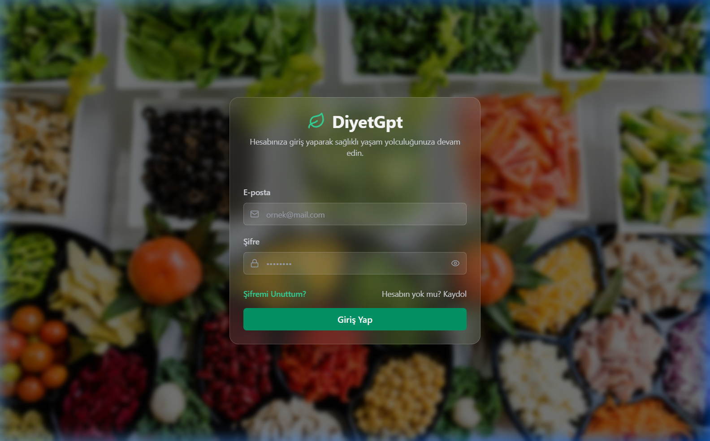
</div>

<br/>

### 📊 Ana Panel (Dashboard)

<div align="center">
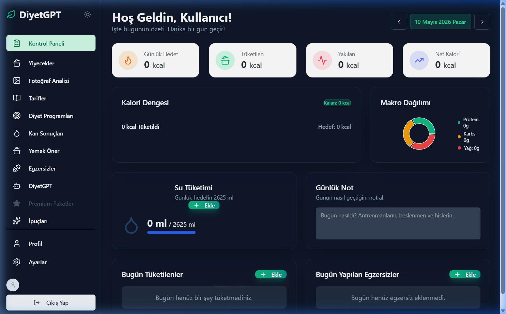
</div>

<br/>

### 🍽️ Yiyecekler & Kalori Takibi

<div align="center">
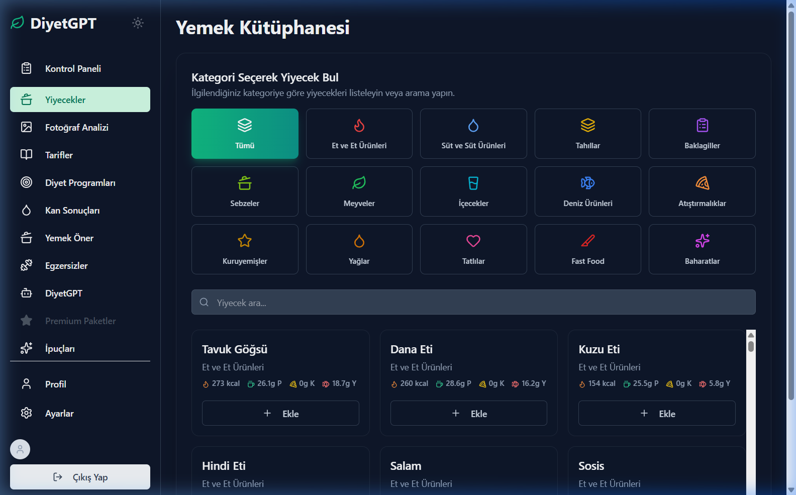
</div>

<br/>

### 📷 Fotoğraf ile Besin Analizi

<div align="center">
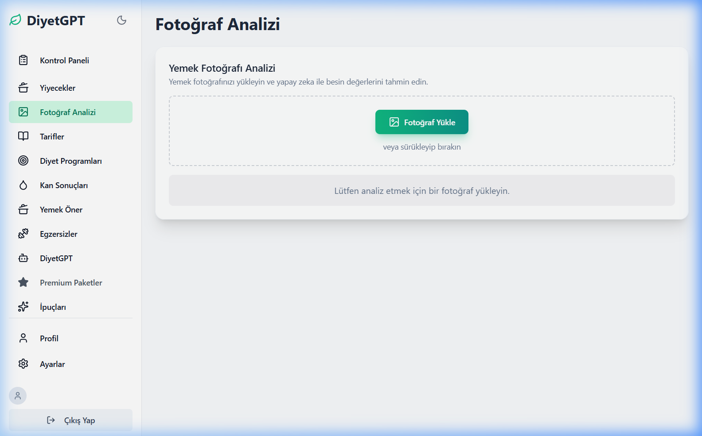
</div>

<br/>

### 🍳 Akıllı Tarif Üretici

<div align="center">
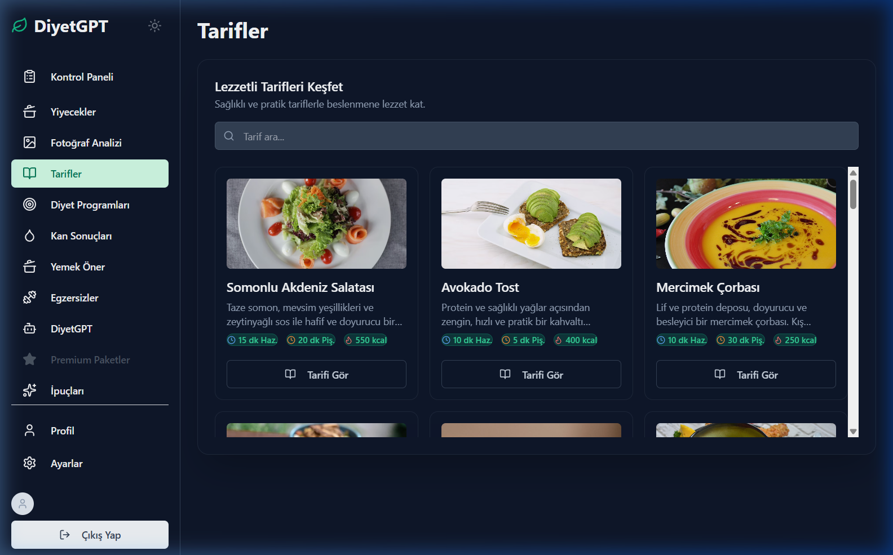
</div>

<br/>

### 🥗 Diyet Programları

<div align="center">
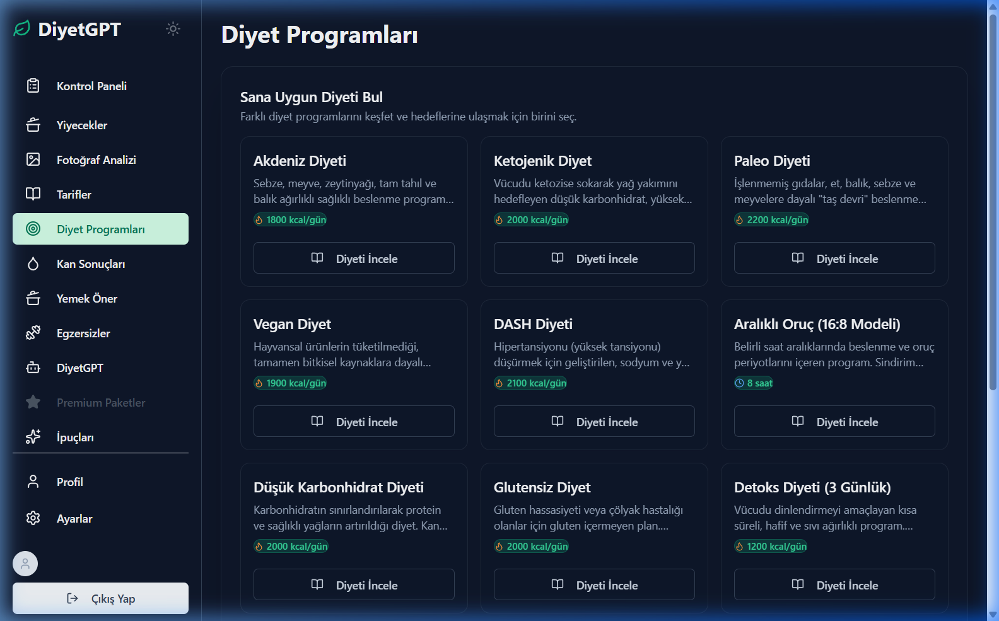
</div>

<br/>

### 🧪 Kan Testi Analizi

<div align="center">
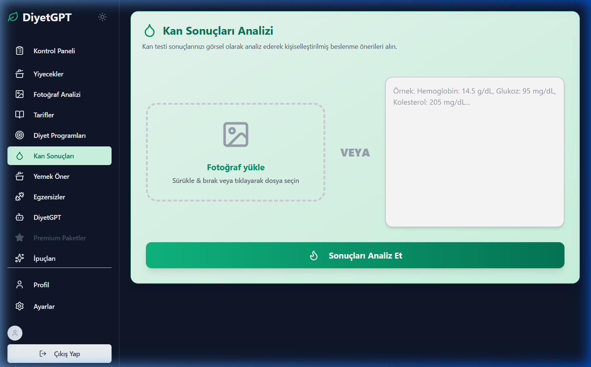
</div>

<br/>

### 💡 Yemek Öner

<div align="center">
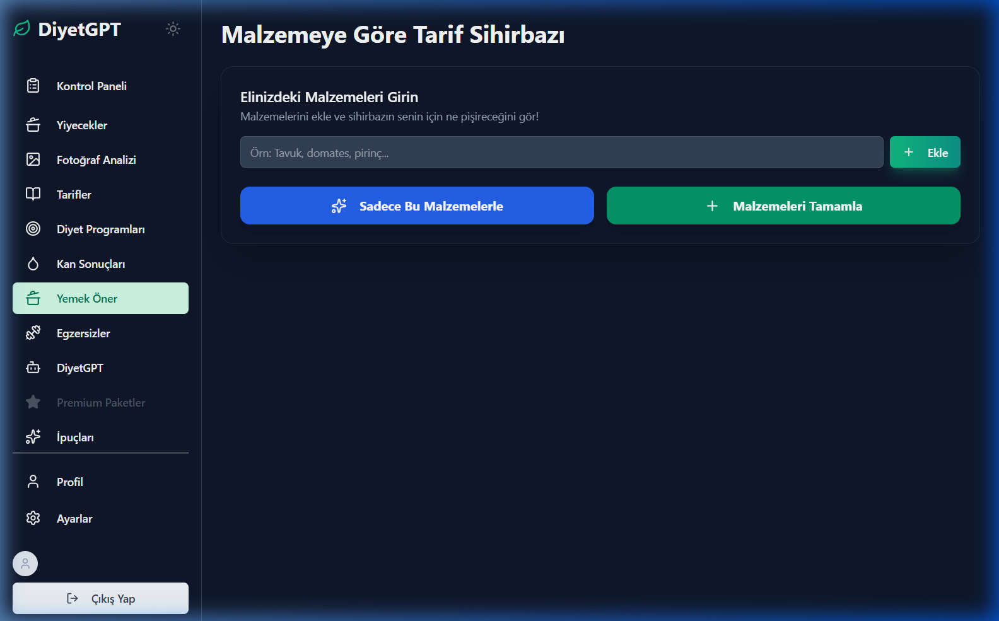
</div>

<br/>

### 🏋️ Egzersizler

<div align="center">
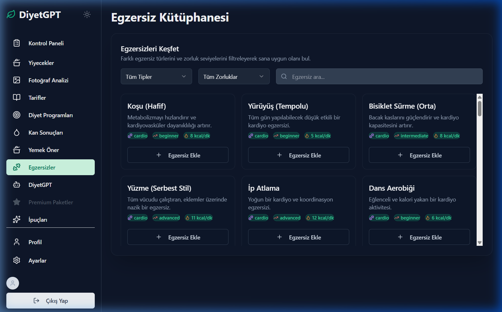
</div>

<br/>

### 🤖 DiyetGPT — AI Diyet Koçu

<div align="center">
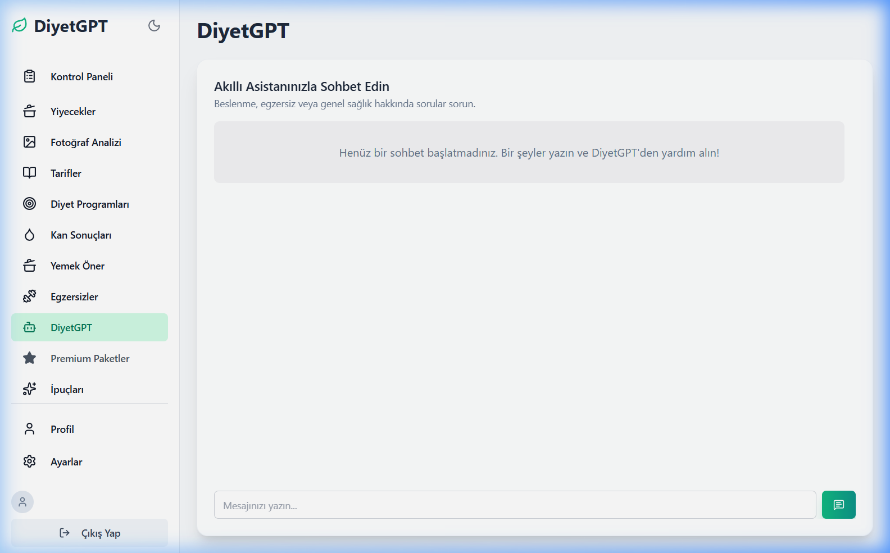
</div>

<br/>

### 💎 Premium Paketler

<div align="center">
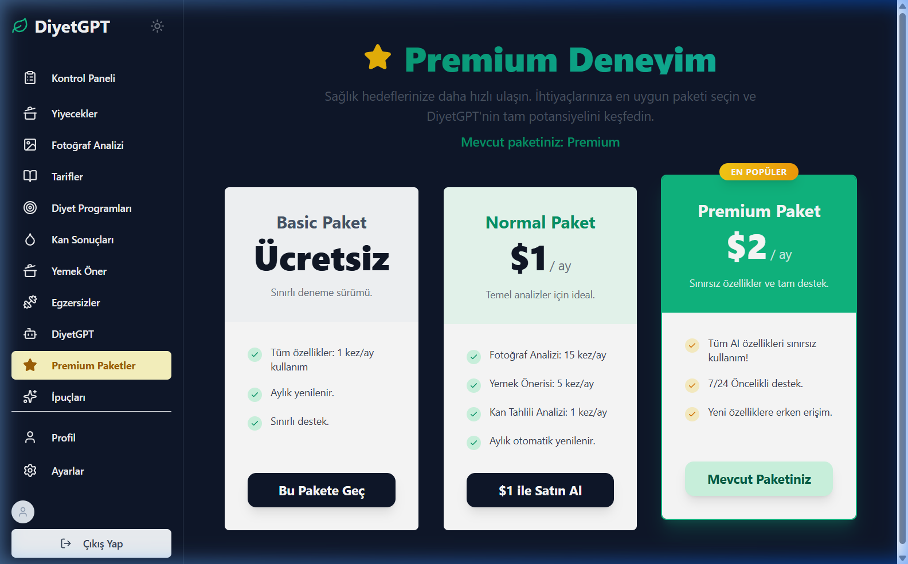
</div>

<br/>

### 💡 Sağlık İpuçları

<div align="center">
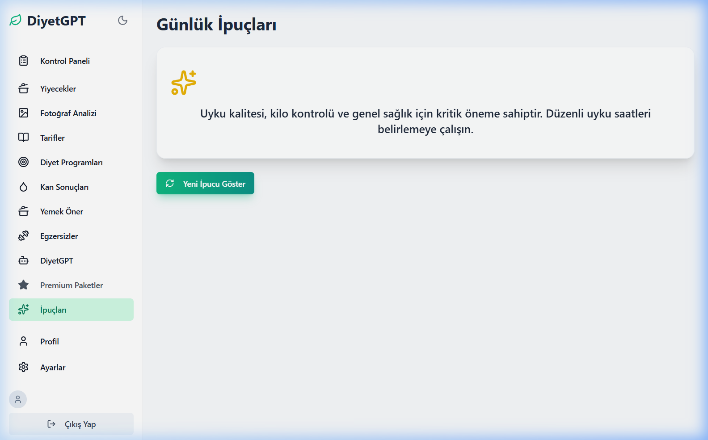
</div>

<br/>

### 👤 Profil

<div align="center">
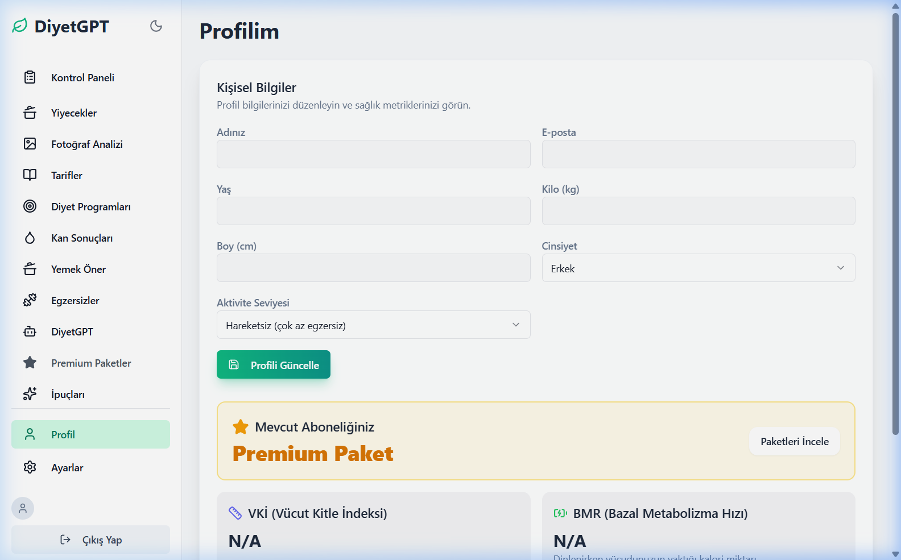
</div>

<br/>

### ⚙️ Ayarlar

<div align="center">
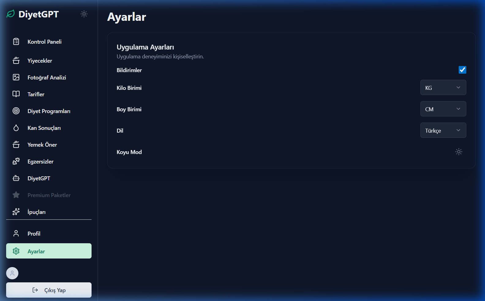
</div>

---

## ✨ Özellikler

<table>
<tr>
<td width="50%">

### 📸 Fotoğraf ile Besin Analizi
Yemek fotoğrafı yükleyin — **Gemini Vision** otomatik olarak:
- Kalori miktarını hesaplar
- Protein / Karbonhidrat / Yağ değerlerini çıkarır
- Porsiyon büyüklüğünü tahmin eder

</td>
<td width="50%">

### 💬 AI Diyet Koçu
**DiyetGPT** ile gerçek zamanlı sohbet:
- Kişiselleştirilmiş beslenme tavsiyeleri
- Spor & sağlıklı yaşam rehberliği
- Kullanıcı profiline göre özelleştirilmiş cevaplar

</td>
</tr>
<tr>
<td width="50%">

### 🧪 Kan Testi Analizi
Laboratuvar sonuçlarınızı **metin veya fotoğraf** olarak yükleyin:
- Referans dışı değerleri tespit eder
- Eksik besin maddelerini belirler
- Beslenme düzeltme önerileri sunar

</td>
<td width="50%">

### 🍳 Akıllı Tarif Üretici
Elinizdeki malzemeleri girin, AI size özel tarifler sunsun:
- **Sıkı mod** — sadece girilen malzemeler
- **Esnek mod** — yakın ikameler dahil
- Makro değerleri ile birlikte tam tarif

</td>
</tr>
</table>

| 🍽️ Kalori & Makro | 🏋️ Egzersiz | 💧 Su Tüketimi | 📅 Geçmiş Loglar |
|:-----------------:|:-----------:|:--------------:|:----------------:|
| Yemek ekle/sil, günlük kalori & makro takibi | Egzersiz kaydet, yakılan kalorileri izle | Günlük su alımını takip et | Tarih bazlı tüm verilere eriş |

---

## 🛠️ Teknoloji Yığını

<div align="center">

```
┌─────────────────────────────────────────────────────────────────┐
│                         FRONTEND                                │
│   React 18 + TypeScript  ·  Vite 7  ·  TailwindCSS 3           │
│   React Router v6  ·  Framer Motion  ·  Axios  ·  Radix UI     │
├─────────────────────────────────────────────────────────────────┤
│                          BACKEND                                │
│   Node.js + Express  ·  SQLite3  ·  Multer  ·  bcrypt          │
│   express-session  ·  JWT  ·  nodemon                           │
├─────────────────────────────────────────────────────────────────┤
│                        AI / CLOUD                               │
│        Google Gemini 2.5 Flash  ·  Gemini Vision API           │
└─────────────────────────────────────────────────────────────────┘
```

</div>

<details>
<summary><b>📦 Detaylı Bağımlılıklar</b></summary>
<br/>

**Frontend**
| Paket | Versiyon | Kullanım |
|-------|---------|---------|
| `react` | 18.2 | UI framework |
| `typescript` | 5.2 | Tip güvenliği |
| `vite` | 7.x | Build aracı |
| `react-router-dom` | v6 | Client-side routing |
| `framer-motion` | latest | Animasyonlar |
| `axios` | latest | HTTP istemcisi |
| `@radix-ui/react-dialog` | latest | Modal bileşenleri |
| `sonner` | latest | Toast bildirimleri |
| `tailwindcss` | 3.x | Utility-first CSS |

**Backend**
| Paket | Versiyon | Kullanım |
|-------|---------|---------|
| `express` | latest | HTTP sunucusu |
| `sqlite3` | latest | Veritabanı |
| `@google/generative-ai` | latest | Gemini API SDK |
| `multer` | latest | Dosya yükleme |
| `bcrypt` | latest | Şifre hash |
| `express-session` | latest | Oturum yönetimi |
| `jsonwebtoken` | latest | JWT token |
| `nodemon` | latest | Auto-restart |

</details>

---

## 🚀 Kurulum

### Ön Gereksinimler

-  — [İndir](https://nodejs.org/)
- 🔑 **Google Gemini API Key** — [Ücretsiz Al](https://aistudio.google.com/apikey)

### ⚡ Hızlı Başlangıç

**1️⃣ Repoyu klonlayın**

```bash
git clone https://github.com/ziyaguner/DiyetGPT.git
cd DiyetGPT
```

**2️⃣ Backend kurulumu**

```bash
cd backend
npm install
```

`.env` dosyası oluşturun:

```env
# Google Gemini API Anahtarı (zorunlu)
GEMINI_API_KEY=your_gemini_api_key_here

# Oturum şifreleme anahtarı
SESSION_SECRET=super_secret_random_string_here

# Sunucu portu
PORT=5000
```

> **İpucu:** `SESSION_SECRET` için: `node -e "console.log(require('crypto').randomBytes(32).toString('hex'))"`

**3️⃣ Frontend kurulumu**

```bash
cd ../frontend
npm install
```

**4️⃣ Uygulamayı başlatın**

```bash
# Terminal 1 — Backend
cd backend && npm run dev

# Terminal 2 — Frontend
cd frontend && npm run dev
```

<div align="center">

| Servis | URL |
|--------|-----|
| 🌐 **Frontend** | `http://localhost:5173` |
| ⚙️ **Backend API** | `http://localhost:5000` |

</div>

---

## 📡 API Referansı

<details open>
<summary><b>🔑 Kimlik Doğrulama</b></summary>

| Method | Endpoint | Açıklama | Body |
|--------|----------|----------|------|
| `POST` | `/register` | Yeni kullanıcı kaydı | `{ name, email, password }` |
| `POST` | `/login` | Giriş yap | `{ email, password }` |
| `POST` | `/logout` | Oturumu kapat | — |

</details>

<details>
<summary><b>👤 Kullanıcı Profili</b></summary>

| Method | Endpoint | Açıklama |
|--------|----------|----------|
| `GET` | `/api/user` | Oturum & profil bilgileri |
| `PUT` | `/api/user/profile` | Profil güncelle (boy, kilo, yaş...) |
| `POST` | `/api/subscribe` | Paket değiştir |

</details>

<details>
<summary><b>🍽️ Günlük Takip</b></summary>

| Method | Endpoint | Açıklama |
|--------|----------|----------|
| `POST` | `/api/add-food` | Yemek ekle |
| `DELETE` | `/api/delete-food/:id` | Yemek sil |
| `POST` | `/api/add-exercise` | Egzersiz ekle |
| `DELETE` | `/api/delete-exercise/:id` | Egzersiz sil |
| `POST` | `/api/add-water` | Su kaydı ekle |
| `GET` | `/api/daily-logs?date=YYYY-MM-DD` | Günlük tüm logları getir |

</details>

<details>
<summary><b>🤖 Yapay Zeka Endpointleri</b></summary>

| Method | Endpoint | Açıklama | Tip |
|--------|----------|----------|-----|
| `POST` | `/api/analyze-image` | Yemek fotoğrafı analizi | `multipart/form-data` |
| `POST` | `/api/analyze-blood-test` | Kan testi analizi | `multipart/form-data` veya `text` |
| `POST` | `/api/chat` | AI diyet koçu sohbeti | `application/json` |
| `POST` | `/api/generate-recipe` | Akıllı tarif üretici | `application/json` |

</details>

---

## 🏗️ Proje Mimarisi

```
DiyetGPT/
│
├── 📁 frontend/                    # React + TypeScript (Vite)
│   ├── 📁 src/
│   │   ├── 📁 pages/
│   │   │   ├── main.tsx            # Giriş noktası & routing
│   │   │   ├── Dashboard.tsx       # Ana panel
│   │   │   ├── Login.tsx           # Giriş sayfası
│   │   │   ├── Register.tsx        # Kayıt sayfası
│   │   │   └── PhotoAnalysis.tsx   # Fotoğraf analiz sayfası
│   │   ├── 📁 components/          # Yeniden kullanılabilir bileşenler
│   │   ├── 📁 lib/                 # Yardımcı fonksiyonlar
│   │   └── index.css
│   └── vite.config.ts
│
├── 📁 backend/                     # Node.js + Express REST API
│   ├── server.js                   # Tüm endpointler & iş mantığı
│   ├── database.sqlite             # SQLite DB (otomatik oluşur)
│   ├── 📁 uploads/                 # Geçici fotoğraf yüklemeleri
│   └── .env                       # 🔒 API anahtarları (git'e dahil değil)
│
├── 📁 screenshots/                 # Uygulama ekran görüntüleri
└── .gitignore
```

### 🗄️ Veritabanı Şeması

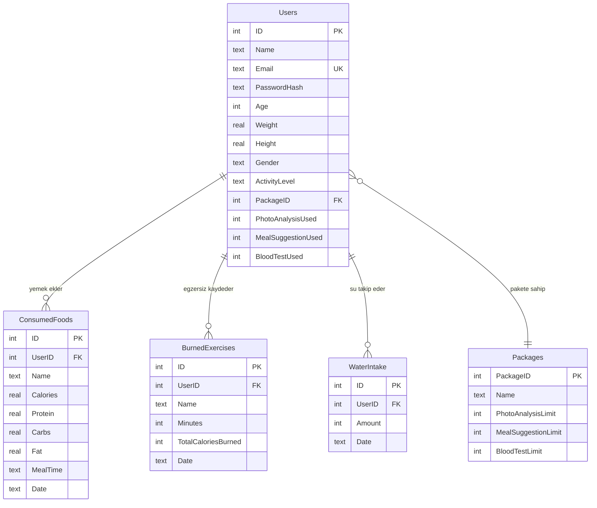

---

## 📦 Paket Sistemi

<div align="center">

| Paket | 📸 Fotoğraf Analizi | 🍳 Tarif Önerisi | 🧪 Kan Testi | 💰 Fiyat |
|:-----:|:------------------:|:----------------:|:------------:|:--------:|
| 🆓 **Free** | 5 / ay | 5 / ay | 1 / ay | Ücretsiz |
| ⭐ **Normal** | 20 / ay | 20 / ay | 5 / ay | — |
| 💎 **Premium** | ♾️ Sınırsız | ♾️ Sınırsız | ♾️ Sınırsız | — |

> Tüm kullanım limitleri her ayın başında otomatik olarak sıfırlanır.

</div>

---

## 🔒 Güvenlik

- 🔐 Şifreler **bcrypt** (salt rounds: 10) ile hash'lenerek saklanır
- 🎫 Oturum yönetimi **express-session** ile sağlanır
- 🗝️ API anahtarları `.env` dosyasında (`.gitignore`'da kayıtlı)
- 🚫 Veritabanı dosyası ve kullanıcı yüklemeleri Git'e dahil edilmez
- 🌐 CORS yalnızca izin verilen origin'lere açıktır

> ⚠️ **Uyarı:** `.env` dosyanızı asla Git'e dahil etmeyin!

---

## 🤝 Katkıda Bulunma

```bash
# 1. Fork edin
# 2. Branch oluşturun
git checkout -b feature/harika-ozellik

# 3. Değişikliklerinizi commit edin
git commit -m "feat: harika özellik eklendi"

# 4. Push edin
git push origin feature/harika-ozellik

# 5. Pull Request açın 🚀
```

---

## 📄 Lisans

Bu proje **MIT Lisansı** ile lisanslanmıştır — detaylar için [LICENSE](LICENSE) dosyasına bakın.

---

<div align="center">


**DiyetGPT** ile sağlıklı yaşam artık daha akıllı! 🥗🤖

[](https://github.com/ziyaguner/DiyetGPT/stargazers)
[](https://github.com/ziyaguner/DiyetGPT/network/members)

Made with ❤️ and 🤖 **Google Gemini AI**

</div>
